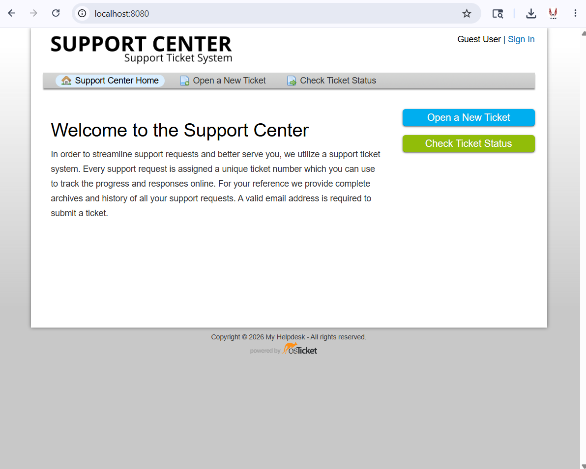
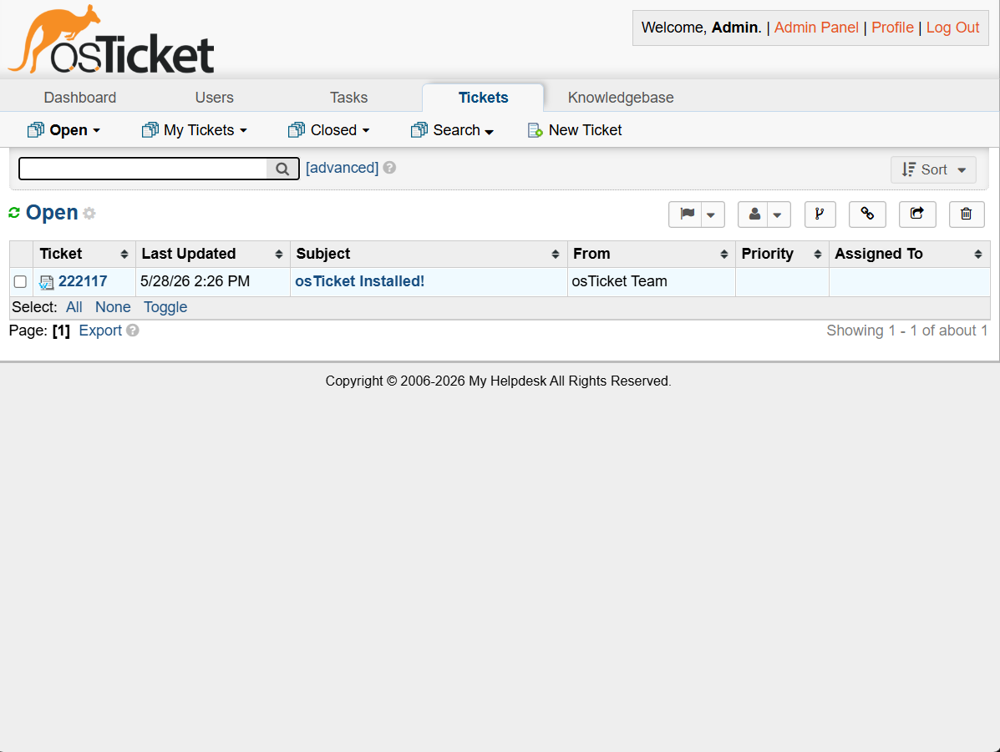
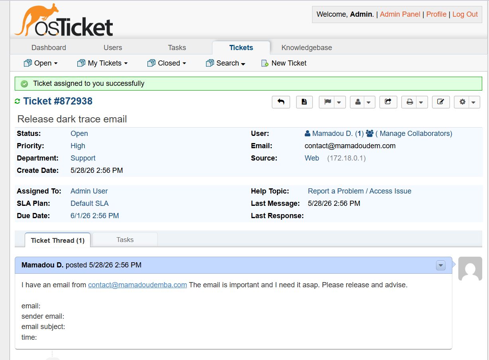
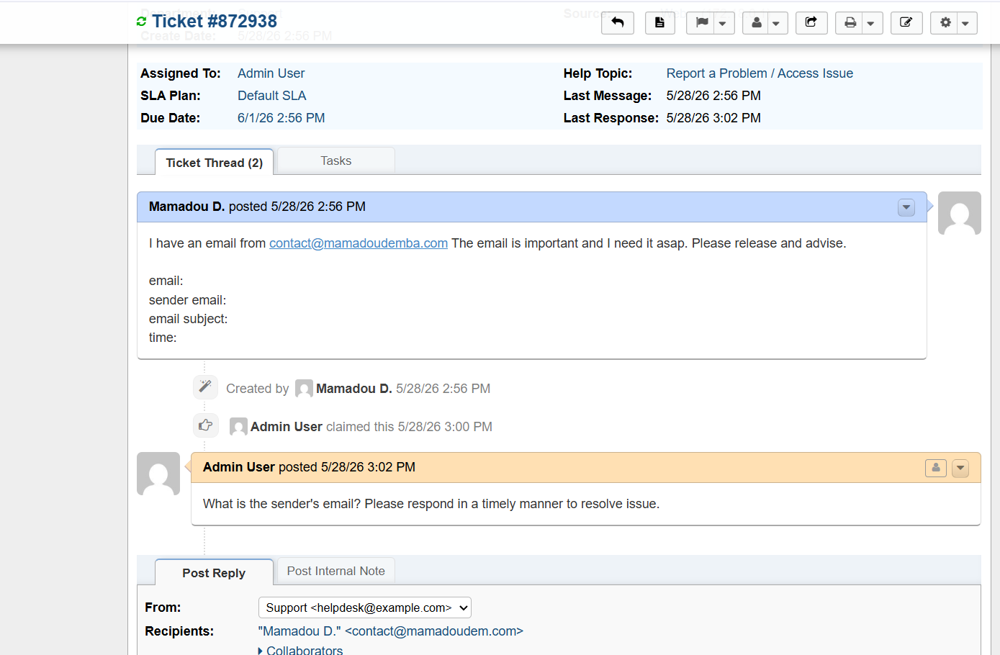
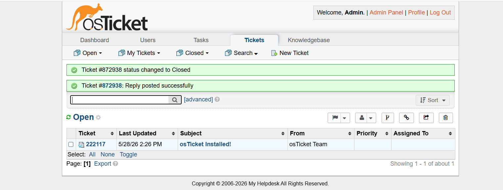
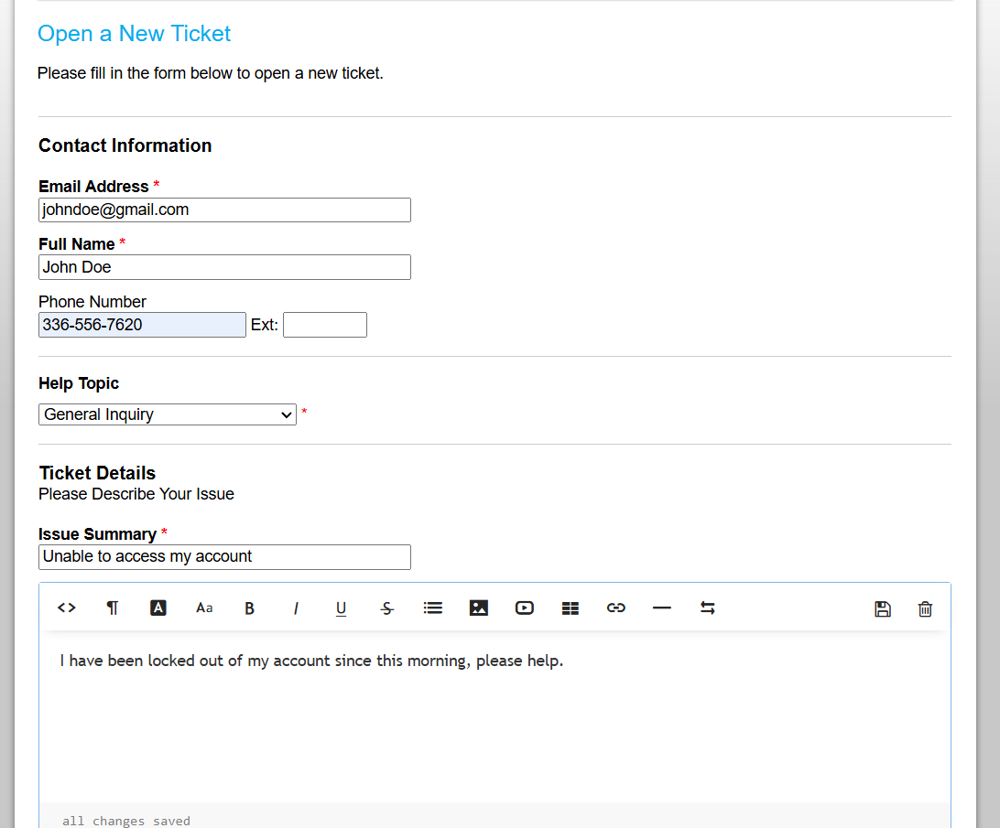
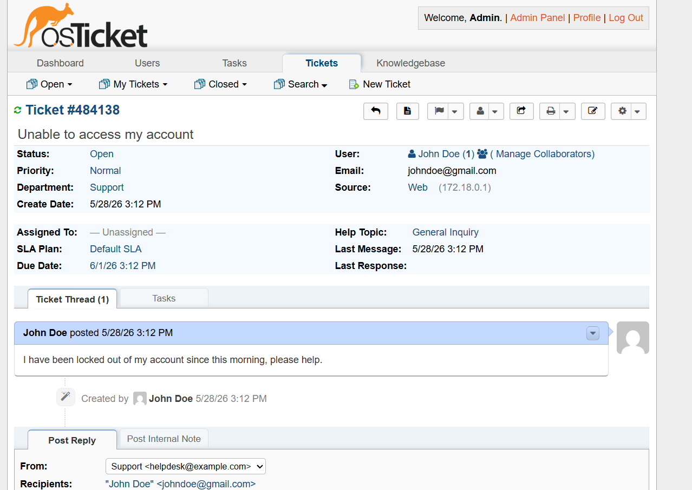
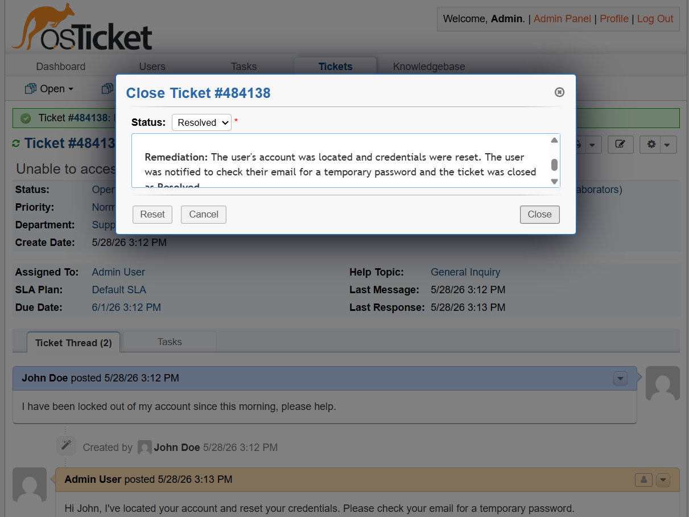
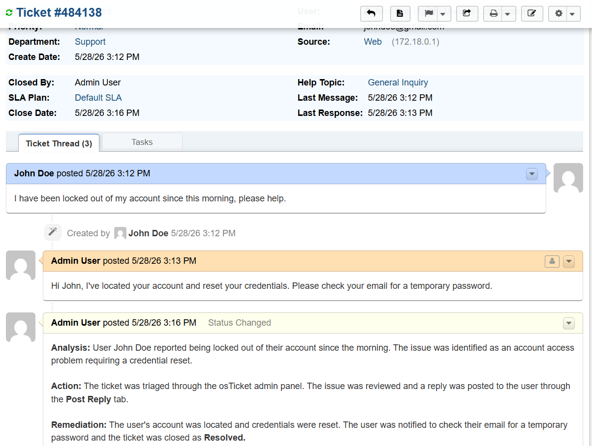

# Project – Help Desk Ticketing Lab with osTicket


---

## Overview

This project demonstrates a fully functional **help desk ticketing system** deployed locally using **Docker** and **osTicket** with a **MySQL** backend. It simulates real-world IT support and SOC analyst workflows — from ticket creation and triage to investigation, reply, and resolution — all documented with evidence.

This lab is directly applicable to roles in **Help Desk**, **IT Support**, **SOC Analysis**, and **Cybersecurity**.

---

## Environment

| Tool | Purpose |
|------|---------|
| osTicket | Open-source help desk ticketing platform |
| Docker | Container runtime for local deployment |
| MySQL | Backend database for osTicket |
| macOS Terminal | Bash command execution and project setup |
| localhost:8080 | Local access point for the ticketing system |

---

## Setup Summary

1. Verified Docker installation via `docker --version`
2. Created project folder and navigated to it via terminal
3. Created `.env` file with environment variables and verified with `cat .env`
4. Created `docker-compose.yml` file and verified with `cat docker-compose.yml`
5. Spun up containers using `docker-compose up -d`
6. Accessed osTicket at `localhost:8080` and logged into the admin panel

---

## Support Center – User-Facing Portal

The **Support Center** is what end users see when submitting a ticket. It provides options to open a new ticket or check on an existing one.


*osTicket Support Center home page — accessible at localhost:8080*

---

## Admin Panel – Ticket Queue

Once logged in as Admin, the ticket queue shows all open tickets with ticket number, subject, submitter, priority, and assignment status.


*Admin panel ticket queue — showing open ticket from the osTicket Team upon fresh install*

---

## Ticket Scenarios

---

### 🟠 Ticket 1 – Release Darktrace Email (Security/SOC Scenario)

**Scenario:** A user reported a quarantined email in Darktrace and requested it be released. This mirrors a common SOC analyst task involving email security triage.

---

#### Step 1 – Ticket Created and Assigned

The ticket was submitted by the user with a request to release a held email. After review, the ticket was claimed and assigned to Admin User.


*Ticket #872938 opened by Mamadou D. — status Open, priority High, assigned to Admin User*

---

#### Step 2 – Follow-Up Reply Posted

The user did not provide the sender's email address, which is required to locate the quarantined email in Darktrace. A reply was posted requesting the missing information.


*Admin User posted a reply requesting the sender's email address from the user*

---

#### Step 3 – Ticket Closed

After gathering all necessary information and completing the investigation, the ticket was resolved and closed.


*Ticket #872938 status changed to Closed — reply posted successfully*

---

### 🔵 Ticket 2 – Unable to Access My Account (Help Desk Scenario)

**Scenario:** A user submitted a ticket reporting they were locked out of their account. This scenario reflects a standard Tier 1 help desk account access issue.

---

#### Step 1 – Ticket Submitted via Support Portal

The user filled out the support form with their contact info, selected "General Inquiry" as the help topic, and described their issue.


*User John Doe submitting a new ticket — issue summary: "Unable to access my account"*

---

#### Step 2 – Ticket Opened in Admin Panel

The ticket appeared in the admin queue. It was reviewed, claimed, and assigned to Admin User for resolution.


*Ticket #484138 in the admin panel — submitted by John Doe, status Open, unassigned*

---

#### Step 3 – Ticket Closed with Resolution Notes

The admin located the account, reset credentials, and notified the user. The ticket was closed as Resolved with a structured closing note including Analysis, Action, and Remediation sections.


*Close Ticket dialog — status set to Resolved with remediation notes entered*


*Full ticket thread showing user message, admin reply, and structured closing notes — ticket closed as Resolved*

---

## Ticket Closing Note Format

When closing tickets, the following structured format was used to document the resolution clearly:

```
Analysis:   What the user reported and what was identified.
Action:     What steps were taken to investigate and resolve the issue.
Remediation: What was done to fix the issue and confirm closure.
```

This format mirrors documentation practices used in enterprise ticketing platforms like **ServiceNow**.

---

## Skills Demonstrated

| Skill | How It Was Applied |
|-------|--------------------|
| Help Desk Ticketing | Created, triaged, replied to, and closed support tickets end-to-end |
| Docker Deployment | Deployed osTicket and MySQL via Docker Compose in a local environment |
| SOC Analyst Workflow | Simulated Darktrace email triage, a real-world daily SOC task |
| Ticket Documentation | Used structured Analysis / Action / Remediation format on ticket closure |
| User Communication | Posted follow-up replies and resolution messages to end users |
| Ticket Assignment | Claimed and assigned tickets to simulate team-based support environments |
| Ticket Transfer | Demonstrated transferring tickets to other departments (e.g., Desktop Services) |
| Ticket Merging | Demonstrated merging duplicate tickets from the same user |

---

## Lessons Learned

**Documentation matters more than most people realize.** Closing a ticket with a vague note like "resolved" is not sufficient. Writing out the Analysis, Action, and Remediation forces you to articulate exactly what you did — which is essential for audit trails, team handoffs, and professional accountability.

**Follow-up communication is part of the job.** When a user doesn't provide enough information, the right response is to post a clear, professional reply requesting specifics — not to guess or wait. This ticket demonstrated that workflow directly.

**osTicket maps closely to enterprise tools.** The core concepts — ticket queues, SLA plans, internal notes, post replies, assignment, and closure statuses — translate directly to platforms like ServiceNow and Jira Service Management used in enterprise environments.

---

## References

- [osTicket Documentation](https://docs.osticket.com/)
- [Docker Documentation](https://docs.docker.com/)
- [ServiceNow IT Service Management](https://www.servicenow.com/products/itsm.html)
- [Darktrace Email Security](https://www.darktrace.com/products/email/)
